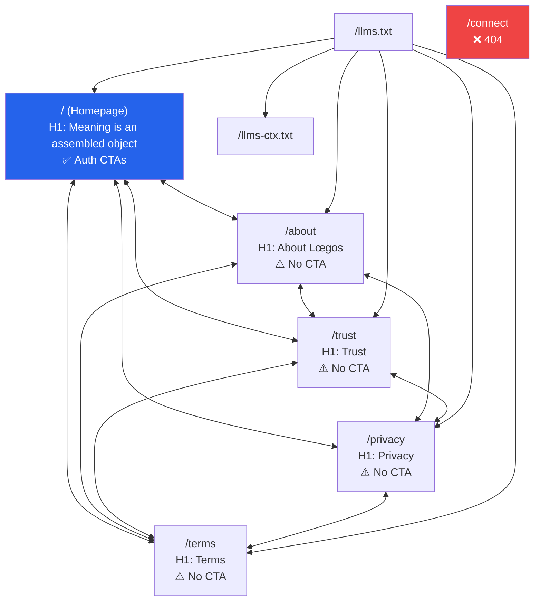
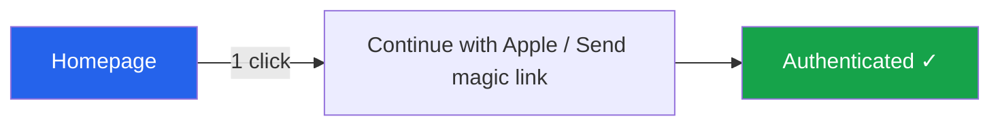
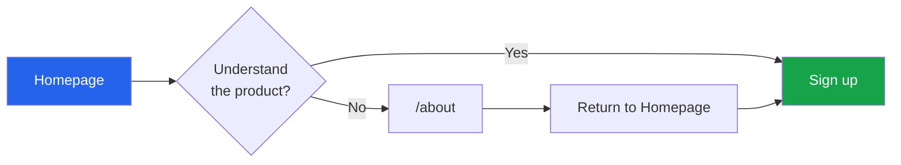
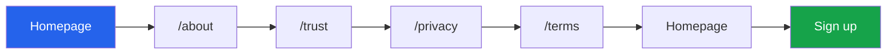

# Loegos.com Site Architecture Audit

**Date:** 2026-04-04
**Domain:** loegos.com / www.loegos.com
**Auditor:** Claude (automated crawl + manual analysis)

---

## 1. Site Stats

| Metric | Value |
|---|---|
| Total public pages | 5 |
| Total LLM-facing files | 2 |
| Total auth-gated routes | 5 |
| Total broken routes | 1 |
| Total internal links | 22 (across all pages) |
| Total external links | 0 |
| Average internal links per page | 4.4 |
| Max crawl depth | 1 (all pages are 1 click from homepage) |
| Subdomains discovered | 0 active (app.loegos.com refuses connections) |
| Pages with CTAs | 1 (homepage only) |
| Pages with zero CTAs | 4 (/about, /trust, /privacy, /terms) |

---

## 2. Architecture Diagram

---

## 3. User Flow Diagrams

### Shortest path: Homepage to Conversion (1 click)

### Most likely new visitor path (2-3 clicks)

### Longest common path (5 clicks before converting)

---

## 4. Product Clarity Assessment

**Score: 4/10**

**Reasoning:**

| Criterion | Assessment |
|---|---|
| **What is it?** | Partially communicated. The meta description ("invite-only, desktop-first workspace for solo operators") is clear but is buried below the fold. The H1 ("Meaning is an assembled object") is philosophically evocative but tells a new visitor nothing about what the product does. |
| **Who is it for?** | "Solo operators" — mentioned in meta description but not prominently on the page itself. No persona examples, no use cases, no "if you're a ___, this is for you." |
| **What does it do?** | The homepage mentions Box, Think, Create, Operate but doesn't explain what any of those mean in practical terms. A visitor must navigate to /about to understand the product model. |
| **What should I do next?** | The CTAs (Apple auth, email magic link) are present and clear. But they're asking for commitment (account creation) before the visitor understands the product. |
| **Social proof** | None. No testimonials, no user counts, no logos, no case studies. |
| **Visuals** | No screenshots, no demo video, no product imagery described in the crawl data. |

**Bottom line:** The site communicates identity and mood but not utility. A new visitor arriving from a search result or link would need to click through to /about to understand what Loegos actually does — and /about has no CTA to bring them back to sign up.

---

## 5. Problem List (Ranked by Severity)

### CRITICAL

| # | Problem | Details |
|---|---|---|
| C1 | **/connect returns 404** | Listed in robots.txt as a disallowed path, but the route is completely dead. If any internal code or email references this URL, users hit a broken page. |
| C2 | **4 of 5 public pages have zero CTAs** | /about, /trust, /privacy, and /terms are informational dead ends. Once a user navigates away from the homepage, there is no call-to-action to bring them back or move them toward signup. |
| C3 | **app.loegos.com refuses connections** | The subdomain has no server. If any marketing material, documentation, or user communication references app.loegos.com, it's a dead link. |

### HIGH

| # | Problem | Details |
|---|---|---|
| H1 | **Zero external links across entire site** | No links to social media, blog, documentation, community, or any external presence. This hurts SEO (outbound link signals), discoverability, and trust. |
| H2 | **No product explanation on homepage** | The H1 is philosophical ("Meaning is an assembled object"). The practical product description is only in the meta tag and on /about. New visitors must navigate away from the conversion page to understand the product. |
| H3 | **/about is a dead end for conversion** | /about explains the product well but has no CTA, no "Try it" button, no link back to the signup flow. Users who go to /about to learn more have no guided path back to conversion. |
| H4 | **Homepage asks for auth before building understanding** | The only CTAs on the homepage are "Continue with Apple" and "Send magic link" — both are account creation actions. There's no intermediate step (demo, video, feature tour) to build confidence first. |

### MEDIUM

| # | Problem | Details |
|---|---|---|
| M1 | **5 auth-gated routes all redirect to homepage login** | /workspace, /library, /intro, /read, /account all silently redirect to the homepage. Users hitting these directly (e.g., from a shared link or bookmark) get no context about why they're seeing a login screen. |
| M2 | **No 404 page differentiation** | /connect returns a 404, but it's unclear if the site has a custom 404 page. Unhandled routes should show a helpful error with navigation options. |
| M3 | **"Draft" labels on Privacy and Terms** | Both legal pages explicitly state they are drafts. While acceptable for beta, this signals incompleteness to users evaluating trust. |
| M4 | **Self-referential navigation links** | /about, /trust, and /terms include links to themselves in the footer navigation. Minor UX issue — active page should be visually distinguished, not a clickable link. |

### LOW

| # | Problem | Details |
|---|---|---|
| L1 | **No Open Graph / social sharing metadata detected** | Sharing loegos.com on Twitter/LinkedIn/Slack may produce a generic preview without image, title, or description. |
| L2 | **No favicon or brand assets detected in crawl** | May affect browser tab display and bookmarking. |
| L3 | **Sitemap only lists 5 pages** | Correct for current state, but should be updated as pages are added. The llms.txt and llms-ctx.txt files are not in the sitemap. |
| L4 | **No structured data for product** | The site uses SoftwareApplication schema but could benefit from FAQ, HowTo, or Organization schema for richer search results. |

---

## 6. Optimization Recommendations (Ranked by Impact)

### Impact: HIGH

**1. Add CTAs to /about, /trust, /privacy, and /terms**
Every informational page should have a clear path back to conversion. At minimum, add a "Try Loegos" or "Back to Home" button with signup context. The /about page is the most critical — it's where confused visitors go to understand the product, and it currently has zero conversion affordance.

**2. Add a product explanation section to the homepage**
Before the auth CTAs, add 3-5 sentences or a visual that explains what Loegos does in practical terms. Something like:
- "Paste a link, upload a PDF, or record a voice memo"
- "Loegos turns it into a Box — a structured workspace"
- "Run Operate to get Aim, Ground, and Bridge analysis"
The philosophical H1 can stay as brand voice, but it needs a practical companion.

**3. Add a "Learn more" CTA on the homepage**
Not everyone is ready to create an account on first visit. Add a secondary CTA like "See how it works" that links to /about or a product tour section. This captures interest without demanding commitment.

**4. Fix or remove /connect**
Either build the /connect page or remove it from the codebase. A 404 on a route listed in robots.txt suggests an incomplete feature.

### Impact: MEDIUM

**5. Add external links**
Link to at least: Twitter/X, LinkedIn, and any blog or documentation. External links build trust and improve SEO.

**6. Improve auth-gated route handling**
When a logged-out user hits /workspace, /library, /intro, /read, or /account, show them why they need to log in and what they'll find after authentication. A blank redirect to the homepage login form provides no context.

**7. Remove "draft" labels from legal pages**
Or replace with "Last updated: [date]" to signal active maintenance rather than incompleteness.

**8. Add social sharing metadata**
Add og:title, og:description, og:image tags to all pages for proper previews when shared on social platforms.

### Impact: LOW

**9. Add llms.txt and llms-ctx.txt to sitemap**
These are valid public resources and should be discoverable.

**10. Differentiate active nav links**
Don't make the current page a clickable link in navigation. Use a visual indicator (bold, underline, different color) instead.

---

## 7. Entry Point & Conversion Analysis

### Entry Points (ranked by likelihood)

| Rank | Page | Why |
|---|---|---|
| 1 | `/` (Homepage) | Primary landing page, only page with auth CTAs |
| 2 | `/about` | Most likely destination for "what is Loegos" searches |
| 3 | `/trust` | Could rank for "AI trust model" or "source provenance" queries |
| 4 | `/llms.txt` | AI agents/crawlers will find and parse this |
| 5 | `/privacy`, `/terms` | Low traffic, accessed by evaluators doing due diligence |

### Conversion Targets

| Target | Location | Type |
|---|---|---|
| Apple Auth | Homepage only | Account creation |
| Email Magic Link | Homepage only | Account creation |

**Critical gap:** There is exactly ONE conversion point on the entire site (the homepage). Every other page is a pure information page with no conversion affordance.

### Path Analysis

| Path | Clicks to Conversion |
|---|---|
| Homepage → Sign up | 1 |
| Homepage → /about → Homepage → Sign up | 3 |
| Homepage → /about → /trust → Homepage → Sign up | 4 |
| Homepage → /about → /trust → /privacy → /terms → Homepage → Sign up | 6 |
| /about (direct landing) → Homepage → Sign up | 2 |
| /trust (direct landing) → Homepage → Sign up | 2 |

### Friction Points

- **Homepage**: Only 4 navigation choices + 2 auth CTAs = low friction, but the auth CTAs are the ONLY options, creating a binary choice (sign up or leave)
- **/about**: 4 navigation choices, zero CTAs = friction point. User has learned about the product but has no guided next step
- **All non-homepage pages**: Information without action = guaranteed extra clicks to convert

### Loops

- `/about` → `/trust` → `/privacy` → `/terms` → `/about` (circular tour through informational pages with no exit toward conversion)
- Any footer nav click chain returns to the same 4-page loop

### Product Understanding Path

- **Minimum clicks to understand what Loegos does**: 2 (Homepage → /about)
- **Minimum clicks to understand AND convert**: 3 (Homepage → /about → Homepage → Sign up)
- **This is 2 clicks more than ideal.** The homepage should communicate enough that a visitor can convert in 1 click.

---

## 8. Summary

Loegos.com is a **5-page site** with a **flat architecture** (all pages are 1 click from homepage). The site is structurally simple but has a fundamental conversion architecture problem: **the only page with any call-to-action is the homepage**, and the homepage **doesn't explain the product well enough** to justify those CTAs.

The result is a site that pushes visitors to either:
1. **Sign up blind** (low conversion probability for a product they don't understand), or
2. **Navigate to /about** to learn more, where they enter a **CTA-free informational loop** with no guided path back to signup.

### The three highest-impact fixes:

1. **Add product explanation to the homepage** — let visitors understand and convert in one page
2. **Add CTAs to /about** — capture the visitors who went to learn more
3. **Fix /connect 404** — clean up the dead route

The site's LLM-facing infrastructure (/llms.txt, /llms-ctx.txt, robots.txt content signals) is thoughtful and ahead of most competitors. The trust model page is genuinely differentiated. The architecture just needs conversion plumbing to match the intellectual depth of the content.
